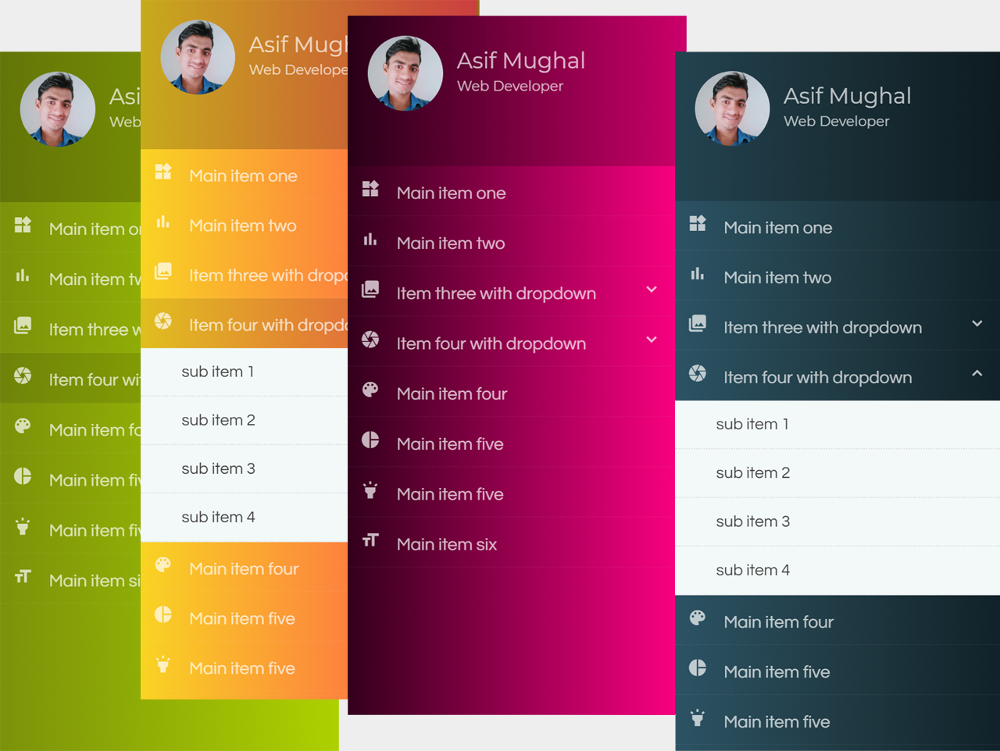

# jQuery jSide Menu
jSide Menu is a well designed, simple and clean side navigation menu with dropdowns. 

Browse: [Live Demo & Using Guide](https://codehimblog.github.io/jquery-jside-menu/)

## Main Features
* Fully Responsive and Customizable.
* Unlimited main items and sub items can be added.
* +20 Built in Skins.
* Sticky Profile.
* CSS3 and jQuery Animations Enabled.
* Material Design Iconic Fonts.
* Background dim-overlay when menu open
* Chrome, Safari, Firefox, Opera, IE7+, IOS, Android and windows phone supported.
* User Friendly and Easy to Implement.

## jSide Preview

## Author
Asif Mughal  
URL: www.codehim.com
